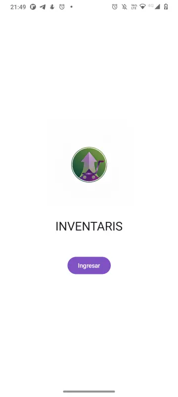
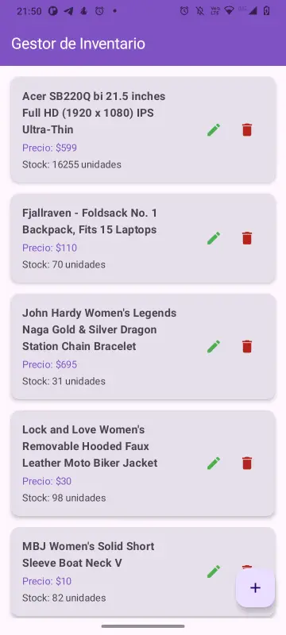
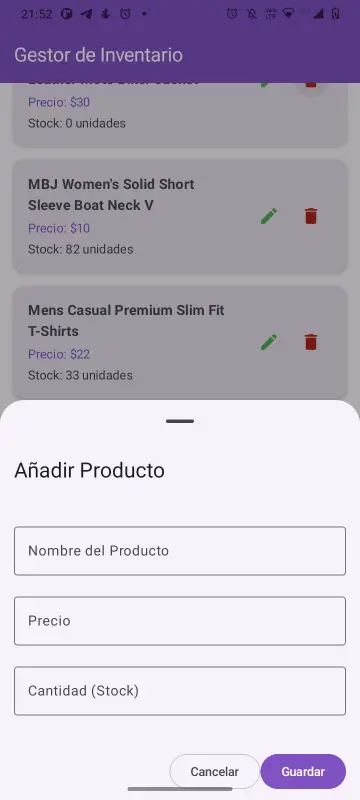
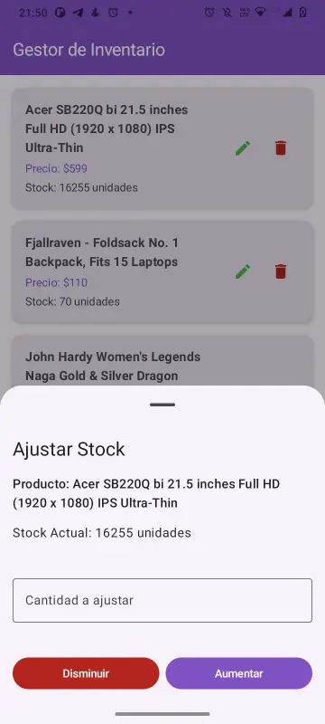
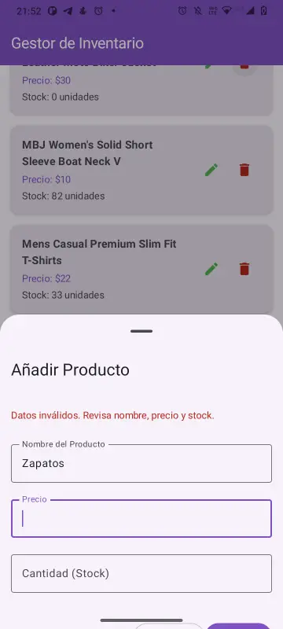
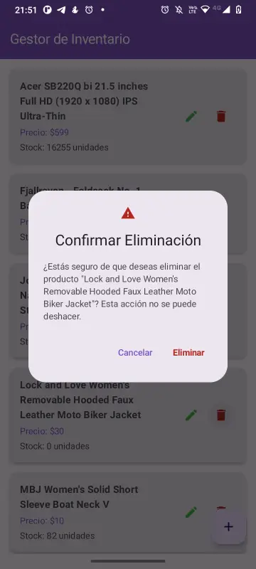
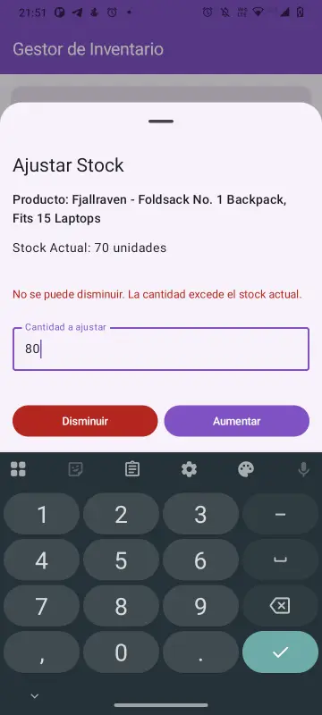
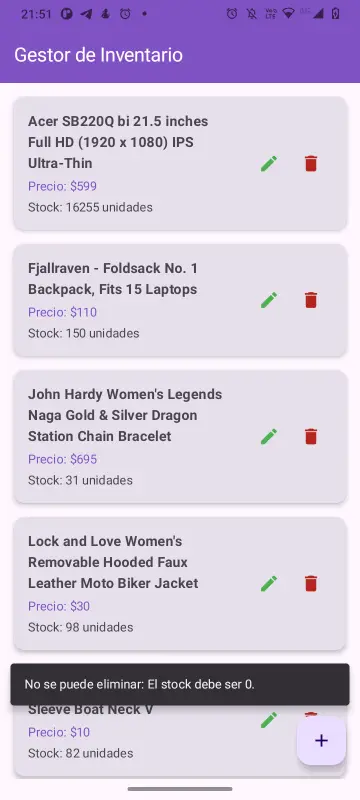

<div align="center">


</div>

<br>

<p align="center">
    
</p>

# Inventaris: Gestor de Inventario Android

**Inventaris** es una aplicación moderna de gestión de inventario para Android, desarrollada para la Evaluación Final del Módulo "Desarrollo de Aplicaciones Empresariales Android".

La aplicación permite a los usuarios gestionar un inventario de productos en tiempo real. Consume datos de una API REST para la carga inicial, persiste todos los cambios localmente en una base de datos Room y permite operaciones CRUD (Crear, Leer, Actualizar, Eliminar) con una lógica de negocio específica (ajuste de stock y reglas de eliminación).

---

## 🚀 Características Principales

* **Pantalla de Bienvenida:** Una pantalla de inicio simple que introduce al usuario a la app.
* **Gestión de Inventario (SSOT):** La app utiliza **Room** como la Única Fuente de Verdad (Single Source of Truth). La API de `fakestoreapi.com` se consume *solo una vez* si la base de datos está vacía, para poblar la lista inicial.
* **Añadir Productos:** Un formulario en un `ModalBottomSheet` permite la creación de nuevos productos.
* **Ajuste de Stock:** En lugar de "editar" el stock, la app implementa un flujo de inventario realista que permite **aumentar** o **disminuir** la cantidad de un producto.
* **Eliminación Segura:** Implementa una regla de negocio que previene la eliminación de un producto si su stock no es cero.
* **Manejo de Errores:** Muestra errores de validación (ej. datos incompletos, stock negativo) y de lógica de negocio (ej. eliminar con stock) de forma clara al usuario.

---

## 🏗️ Arquitectura del Proyecto

El proyecto sigue una arquitectura **MVVM (Model-View-ViewModel)** robusta, con principios de **Clean Architecture** para una clara separación de responsabilidades.

La estructura de paquetes refleja esta arquitectura:

* **`data/` (Capa de Datos):**
    * `local/`: Contiene la definición de **Room** (`ProductDao`, `ProductDatabase`).
    * `model/`: Define la entidad `Product` usada en la base de datos y en la UI.
    * `remote/`: Define la interfaz de **Retrofit** (`ApiService`) y los DTOs (`ProductResponse`).
    * `repository/`: `ProductRepository` actúa como la Única Fuente de Verdad, decidiendo si obtener datos de la red o de la base de datos.
* **`di/` (Inyección de Dependencias):**
    * Contiene los módulos de **Hilt** (`DatabaseModule`, `NetworkModule`) que proveen las instancias de Room y Retrofit al resto de la app.
* **`ui/` (Capa de UI):**
    * `navigation/`: Gestiona la navegación entre pantallas con **Jetpack Compose Navigation**.
    * `theme/`: Define los colores (basados en el logo) y la tipografía de **Material 3**.
    * `view/screens/`: Contiene los **Composables** (`ProductScreen`, `SplashScreen`) y sus `ProductViewModel`, que exponen el estado a la UI mediante **StateFlow**.
    * `view/screens/components/`: Composables reutilizables (`ProductItem`, `ProductForm`, `StockAdjustSheet`, etc.).

---

## 🛠️ Stack Tecnológico

* **Lenguaje:** **Kotlin** 100%.
* **Arquitectura:** **MVVM** / **Clean Architecture**.
* **UI:** **Jetpack Compose** para una interfaz de usuario declarativa, moderna y reactiva, usando **Material Design 3** y **Navigation Compose**.
* **Inyección de Dependencias:** **Hilt (KSP)** para gestionar el ciclo de vida de las dependencias y facilitar el *testing*.
* **Asincronía:** **Kotlin Coroutines** y **StateFlow** para gestionar el estado de la UI y las operaciones asíncronas.
* **Base de Datos (Persistencia):** **Room** para la persistencia local de los productos.
* **Red (Consumo API):** **Retrofit 2** con **Kotlinx Serialization** para un *parsing* de JSON eficiente.
* **Testing (Calidad):**
    * **Unitarios:** **JUnit 4** y **MockK** para probar la lógica del `ProductViewModel`.
    * **Instrumentación (UI):** **Hilt Android Testing** y **Compose UI Test** (`onNodeWithTag`) para verificar los flujos de la interfaz de usuario.

---

## 🎨 Capturas de Pantalla

*Imágenes obtenidas de la carpeta `assets` del proyecto.*

| Inicio | Lista de Productos |
| :---: | :---: |
|  |  |
| **Añadir Producto** | **Ajustar Stock** |
|  |  |
| **Errores de Formulario** | **Confirmación y Errores de Lógica** |
|  |  |
|  |  |

---

## ⚙️ Cómo Ejecutar Localmente

Sigue estos pasos para compilar y ejecutar la aplicación en tu máquina local.

1.  **Clonar el Repositorio:**
    ```bash
    git clone https://github.com/yerkoppp/InventarioMod6
    ```
2.  **Abrir en Android Studio:**
    * Abre Android Studio (Recomendado: versión Koala 2024.1.1 o más reciente).
    * Selecciona `File > Open` y navega hasta la carpeta del proyecto clonado.
3.  **Sincronizar Gradle:**
    * Android Studio detectará el proyecto y sincronizará los archivos de Gradle. El proyecto utiliza KSP, por lo que el IDE puede necesitar descargar las dependencias.
4.  **Ejecutar la App:**
    * Selecciona un emulador de Android (API 30 o superior) o conecta un dispositivo físico.
    * Haz clic en el botón "Run" (▶️) en la barra de herramientas.

---

## 🧪 Cómo Probar la Aplicación

Este proyecto incluye un conjunto de pruebas unitarias y de instrumentación para garantizar la calidad del código, cumpliendo con los requisitos de la evaluación.

### 1. Pruebas Unitarias (Lógica)

Estas pruebas validan la lógica interna del `ProductViewModel` (como las reglas de negocio para eliminar y ajustar stock).

* **Ubicación:** `app/src/test/java/`
* **Cómo ejecutarlas:**
    1.  En Android Studio, abre el archivo `ProductViewModelTest.kt`.
    2.  Haz clic derecho en el nombre de la clase `ProductViewModelTest`.
    3.  Selecciona "Run 'ProductViewModelTest'".
    4.  Verás los resultados en la pestaña "Run" (deben salir en verde).

### 2. Pruebas de Instrumentación (UI)

Estas pruebas lanzan la UI real de la app en un emulador y verifican los flujos de usuario (como la carga de datos y la creación de un producto).

* **Ubicación:** `app/src/androidTest/java/`
* **Cómo ejecutarlas:**
    1.  Asegúrate de tener un emulador o dispositivo conectado.
    2.  En Android Studio, abre el archivo `ProductScreenTest.kt`.
    3.  Haz clic derecho en el nombre de la clase `ProductScreenTest`.
    4.  Selecciona "Run 'ProductScreenTest'".
    5.  La app se compilará, instalará en el emulador y ejecutará los flujos automáticamente.

---

## 📦 Generación del Release (APK/AAB)

Para generar el archivo `.aab` o `.apk` firmado para producción, sigue los pasos detallados en la guía **"Guía de Release de App.pdf"** incluida en este repositorio.

### Resumen del Proceso:

1.  **Configurar ProGuard:** Asegúrate de que las reglas en `proguard-rules.pro` estén correctas (Hilt, Room, Kotlinx Serialization).
2.  **Ir a Android Studio:** `Build > Generate Signed Bundle / APK...`.
3.  **Seleccionar Formato:** Se recomienda **Android App Bundle (.aab)**.
4.  **Crear/Usar Keystore:** Sigue el asistente para crear una nueva clave de firma (`.jks`) o usar una existente. **¡Guarda esta clave y sus contraseñas en un lugar seguro!**
5.  **Seleccionar Variante:** Elige la variante de compilación **release**.
6.  **Finalizar:** Android Studio generará el archivo `.aab` firmado, listo para ser subido a Google Play.

## 👨‍💻 Autor


**[Yerko Osorio]**

- GitHub: [@yerkoppp](https://github.com/yerkoppp)

---

<div align="center">

**⭐ Si te gustó este proyecto, considera darle una estrella ⭐**

Hecho con ❤️ y Kotlin

</div>